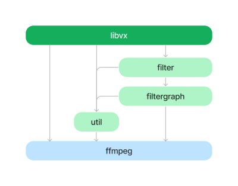

# VideoProcessorNative
Video frame extraction library using ffmpeg

## Requirements

Requires, at minimum, an LGPL static build of ffmpeg v5.1.x. This is not provided here, though it is referenced by default in [packages.config](packages.config). There are many options for compiling ffmpeg, though the simplest is probably [using vcpkg](https://trac.ffmpeg.org/wiki/CompilationGuide/vcpkg).

## Build

```
msbuild VideoProcessorNative.sln -restore -target:"Clean;Rebuild" -property:"Platform=x64;Configuration=Release"


sudo apt install -y openssh-server build-essential gdb rsync make zip
wget https://github.com/microsoft/CMake/releases/download/v3.19.4268486/cmake-3.19.4268486-MSVC_2-Linux-x64.sh
chmod +x cmake-3.19.4268486-MSVC_2-Linux-x64.sh
sudo ./cmake-3.19.4268486-MSVC_2-Linux-x64.sh --skip-license --prefix=/usr


cmake . -B build_linux/
nuget restore packages.config -SolutionDirectory build_linux/ -ConfigFile ~/.nuget/NuGet/NuGet.Config
cmake --build build_linux/
```

## Architecture

